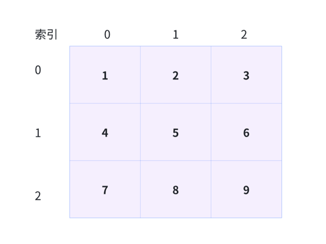

## 数据结构层面，需要掌握以下几种：
- 数组
- 栈
- 队列
- 链表
- 树 (二叉树、二叉搜索树)
## 数组
数组作为最简单、最基础的数据结构，大多数的语言都天然地对数组有这原生的表达，JavaScript亦然。这意味着可以对数组做到"开箱即用"，非常方便。

### 数组的创建
> 最多的创建方式相比就是直接方括号+元素内容
```javascript
const array = [1,2,3,4,5]
```
不过在算法题中，很多时候我们初始化一个数组时，并不知道它内部元素的情况，这种场景下，要给大家推荐的是构造函数创建数组的方法
```javascript
const array = new Array()
```
当我们以构建函数的形式创建数组时，若我们想楼上这样，不传任何参数，得到的就会是一个空数组。等价于：
```javascript
const array = []
```
不过使用构造函数，可不是为了创建空数组这么无聊。
需要它的时候，往往是因为我们有"创造指定长度的空数组"这样的需求。需要多长的数组，就给它传多大的参数:
```javascript
const array = new Array(5)
```
这样就创建了一个长度为5的空数组，数组内部的元素都是undefined。

在一些场景中，这个需求会稍微变得有点复杂，创建一个长度确定，同时每一个元素的值也都确定的数组。这时我们可以调用fill方法，
假设需求是每个坑里都填上一个1，只需要给他fill一个1
```javascript
const array = new Array(5).fill(1)
```
如此便可以得到一个长度为5，且每个元素都初始化为1的数组

#### 数组的访问和遍历
访问数组中的元素，我们直接在中括号中指定其索引即可：
```javascript
const array = [1,2,3,4,5]
console.log(array[0]) // 1
```
而遍历数组，这个方法就多了，不过目的往往都是一致的，访问到数组中的每个元素，并且知道当前元素的索引。

1. for循环
   这个是最最基础的操作。我们可以通过循环数组的下标，来一次访问每个值
```javascript
const array = [1,2,3,4,5]
// 获取数组长度
const len = array.length
for(let i =0;i<len;i++){
    // 输出数组的元素值和索引
    console.log(array[i],i)
}
```
2. forEach
   通过取forEach方法中传入函数的第一个入参和第二个入参，我们也可以取到数组每个元素的值以及对应的索引
```javascript
 array.forEach((item,index)=>{
     console.log(item,index)
 })
```
3.map方法
   毛方法在调用形式上与forEach无异，区别在于map方法会根据你传入的函数逻辑对数组中每个元素进行处理、进而返回一个全新的数组。
所以其实map做的事情不仅仅是遍历，而是在遍历的基础上"再加工"。当我们需要对数组内容做批量修改、同事修改的逻辑又高度一致时，就可以调用
map来达到我们的目的：
```javascript
const array = [1,2,3,4,5]
const newArray = array.map((item,index)=> {
    // 输出数组的元素值和索引
    console.log(item,index)
   // 返回新的数组
    return item * 2
})
```
这段代码就通过map来返回了一个全新的数组，数组中每个元素的值都是在其现有元素值的基础上+1后的结果。

如果没有特殊的需要，那么同意使用for循环来实现遍历。因为从性能上看，for循环遍历是最快的。
为什么说从性能的角度上看，for循环遍历是最快的：
1. 优化：JavaScript 引擎对 for 循环进行了高度优化，能够更有效地管理内存和执行指令。因为 for 循环的结构简单，很多引擎可以通过优化技术提升其执行速度。

2. 控制循环变量：for 循环允许你直接控制循环变量的增量，这意味着可以根据需要精确控制循环的行为。

3. 避免额外开销：其他遍历方法（如 forEach、map 等）可能会有额外的函数调用开销，这在大数据集上会变得显著。

4. 简化的条件判断：在 for 循环中，循环条件和变量更新都在一个地方定义，减少了上下文切换的需要。

5. 直接访问数组索引：for 循环可以直接通过索引访问数组元素，而其他方法通常需要额外的步骤或闭包来处理元素。

其实 for循环遍历 与 forEach、map 等方法的性能差距并不是很大，但是在大数据集上，for 循环的性能优势会更加明显。
forEach、map 在可读性上要耗油for循环。因此，选择循环方法时，性能和可读性之间需要找到平衡。

## 二维数组
```javascript
const array = [
    [1,2,3],
    [4,5,6],
    [7,8,9]
]
```
直接把它的逻辑结构画出来看，是这样：

图中的每一行，就代表着一个数组元素。比如第0行，就代表着数组中array[0]这个数组元素，其内容是[1,2,3]
每一行中的每一列，则代表一个确切的坑，比如第0行第0列，就代表着数组中array[0][0]这个元素，其值是1。
二维数组的特点：
从形状上看，相对于一维数组一条线的布局，二位数组更像是一个面，拿上面的图片举例子，这里的二维数组逻辑
分布图 就宛如一个正方形。当然如果我们稍微延长一下其中的一边，他也可以是一个矩形、

在数学中，形如这样的长方阵列排列的复数或实数集合，被称为矩阵，因此二维数组的别名就叫矩阵。

### 二维数组的创建

#### fill的局限性

比如我们fill 用顺了手，就本本地想用fill解决所有的问题，比如初始化一个二维数组
```javascript
const arr = (new array(3)).fill((new Array(3)).fill([]))
```
乍一看没毛病，3个坑都被填上了数组元素。
但是当我们想修改某一坑里的数组的值的时候
```javascript  
arr[0][0].push(9)
```
你会发现一整列的元素都被设成了9
这是什么骚操作。 这就要从fill的工作机制说起了。
当给fill传递一个入参时，如果这个入参的类型是引用类型，那么fill在填充坑的时候，填充的是这个引用类型的引用。

#### 初始化一个二维数组
```javascript
const len = 3
for(let i = 0;i<len;i++){
    // 将数组的每一个坑位初始化为数组
    arr[i] = []
}
```
for循环中，每一次迭代我们都通过[] 来创建一个新的数组，这样便不会有引用指向问题带来的麻烦。

#### 二维数组的访问和遍历
访问二维数组中的元素，我们直接在中括号中指定其索引即可：
```javascript
const array = [
    [1,2,3],
    [4,5,6],
    [7,8,9]
]

for (let i =0;i<array.length;i++){
    // 缓存内部数组长度
    const innerLen = array[i].length;
    for(let j = 0;j<innerLen;j++){
        // 输出数组的元素值和索引
        console.log(array[i][j],i,j)
    }
}
```

一维数组用for循环遍历只需一层循环，二维数组是两层，三维数组是三层，以此类推。