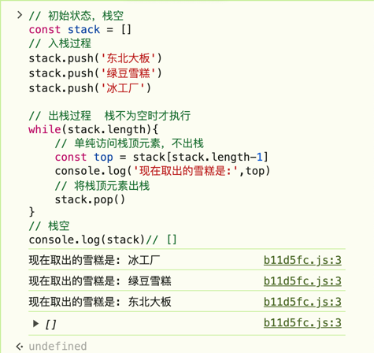

## 栈和队列

在JavaScript中，栈和队列的实现一般都要
依赖于数组，完全可以把栈和队列都看作是"特别的数组"

## 数组中增加元素的三种方法
- unshift
```javascript
const array = [1,2,3,4,5]
array.unshift(0)
```
- push
```javascript
const array = [1,2,3,4,5]
array.push(6)
```
- splice
```javascript
const array = [1,2,3,4,5]
array.splice(2,0,2.5)
```
重点记录下这个splice方法，相对熟悉的应该还是 splice 用于删除的操作：
```javascript
arr.splice(2,1)
```
第一个入参是其实的索引值，第二个入参表示从起始索引开始需要删除的元素个数。
这里我们指明索引为2，删除一个元素，即删除了数组中的第三个元素。这就是数组赵公删除
任意位置元素的方法。

至于传入两个以上参数这种用法，是用于在删除的同时完成数组元素的新增。而从第三个
位置开始的入参，都代表着需要添加到数组里的元素的值：
```javascript
arr.splice(2,1,2.5)
```
这里我们指明索引为2，删除一个元素，同时在删除的位置插入一个2.5。这样数组就变成了
[1,2,2.5,3,4,5]。

## 数组中删除元素的三种方法
- shift - 删除数组头部元素，返回被删除元素
```javascript
const array = [1,2,3,4,5]
array.shift() // 1
console.log(array) // [2,3,4,5]
```
- pop  - 删除数组尾部元素，返回被删除元素
```javascript
const array  = [1,2,3,4,5]
array.pop(); //5
console.log(array) // [1,2,3,4]
```
- splice - 删除数组中指定位置的元素
```javascript
const array = [1,2,3,4,5]
array.splice(2,1)
console.log(array) // [1,2,4,5]
```
## 栈 (stack) 只用pop和push完成增删的"数组"
栈是一种后进先出（LIFO,Last In First Out）的数据结构
我们可以把它想象成小时候学校门口小卖部里，落满了雪糕的方形大冰柜。
小卖部老板往里面摆置雪糕的时候，最先摆进去的会放在冰柜的底部，最后摆进去的会放在冰柜的顶部。
如果这时候我们去买雪糕，老板会把冰柜顶部的那个取出来给我们，在冰淇淋不断被取出的这个过程里，越是后来放进去的，越是被先取出来，越是先放进去的，越是最后被取出来。
这个过程，就是所谓的"后进先出"。

我们想想这个过程有两个特征：
- 只能从尾部取出元素
- 只能从尾部添加元素
对应到数组的方法，刚好就是push 和pop。因此，我们可以认为在JavaScript中，栈就是限制了只能用push来添加元素，同时只能用pop来取出元素的一种特殊数组。

除了pop和push 之外，栈相关的面试题中往往还会涉及到取栈顶元素的操作。所谓栈顶元素，实际上它值得就是数组尾部的元素。

下面我们介于数组来实现一波栈的常用操作，完成"放置雪糕"和"取出雪糕" 的过程：
```javascript
// 初始状态，栈空
const stack = []
// 入栈过程
stack.push('东北大板')
stack.push('绿豆雪糕')
stack.push('冰工厂')

// 出栈过程  栈不为空时才执行
while(stack.length){
    // 单纯访问栈顶元素，不出栈
    const top = stack[stack.length-1]
    console.log('现在取出的雪糕是:',top)
    // 将栈顶元素出栈
    stack.pop()
}
// 栈空
console.log(stack)// []
```
丢到控制台运行，雪糕就会按照后进先出的顺序呗取出：



## 队列(queue) 只用push和shift完成增删的"数组"

队列是一种先进先出(FIFO,First In First Out)的数据结构。
我们可以把它想象成小时候在食堂排队打饭的场景。排在最前面的人最先打到饭，排在最后面的人最后打到饭。
这个过程，就是所谓的"先进先出"。

这个过程的规律也很明显：
- 只允许从尾部添加元素
- 只允许从头部移除元素
也就是水整个过程只涉及了数组的 push 和 shift方法。
在栈元素出栈时，我们关心的是栈顶元素(数组的最后一个元素)；队列元素出栈时，我们关心的则是队头元素（数组的第一个元素）。

下面我们用数组来实现一波队列的常用操作，完成"排队打饭"的过程：
```javascript
// 初始状态，队列空
const queue = []
// 入队过程
queue.push('小明')
queue.push('小红')
queue.push('小刚')
// 出队过程  队列不为空时才执行
while(queue.length){
    // 单纯访问队头元素，不出队
    const front = queue[0]
    console.log('现在打饭的人是:',front)
    // 将队头元素出队
    queue.shift()
}
// 队列空
console.log(queue) // []
```

## 链表
链表和数组相似，他们都是有序的列表，都是线性结构（有且仅有一个前驱，有且仅有一个后继）。不同点在于，
在链表中，数据单位的名称叫做"结点"，而结点和结点的分布，在内存赵公可以是离散的。
这个"离散"是相对于数组的"连续"来说的。


